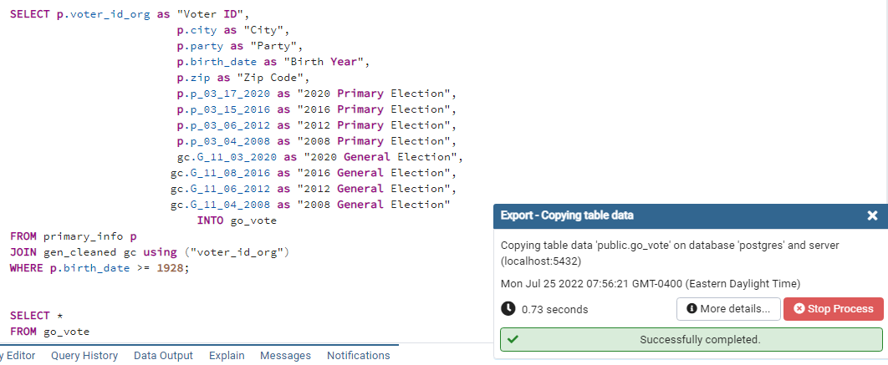
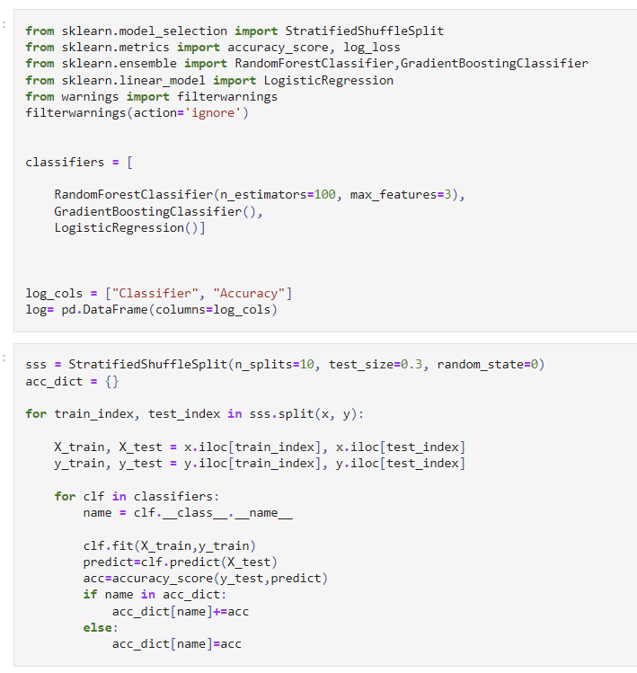
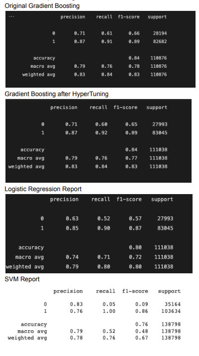
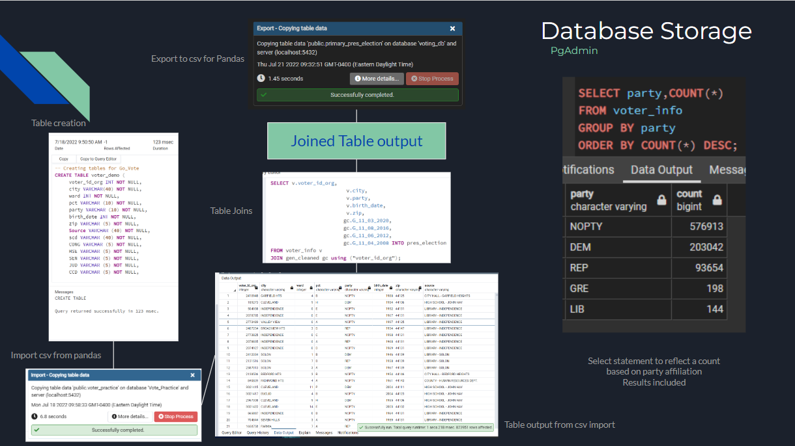
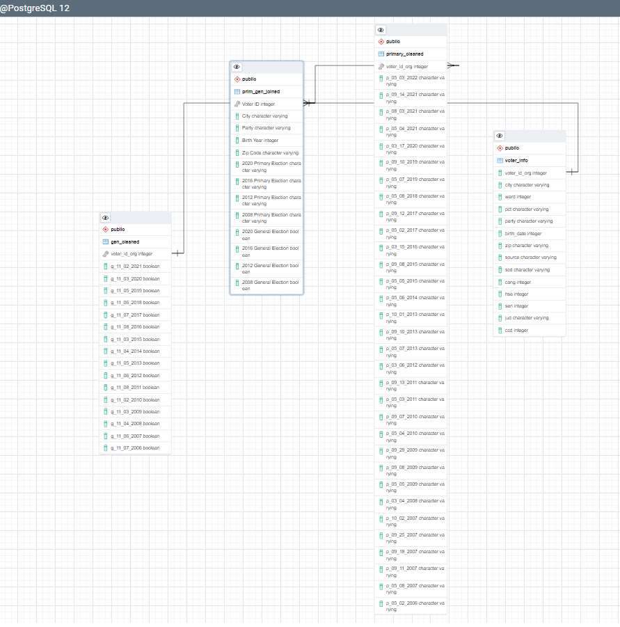
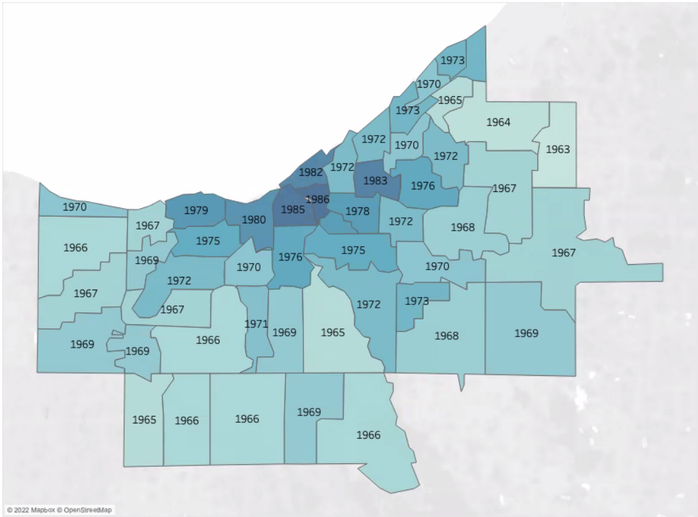
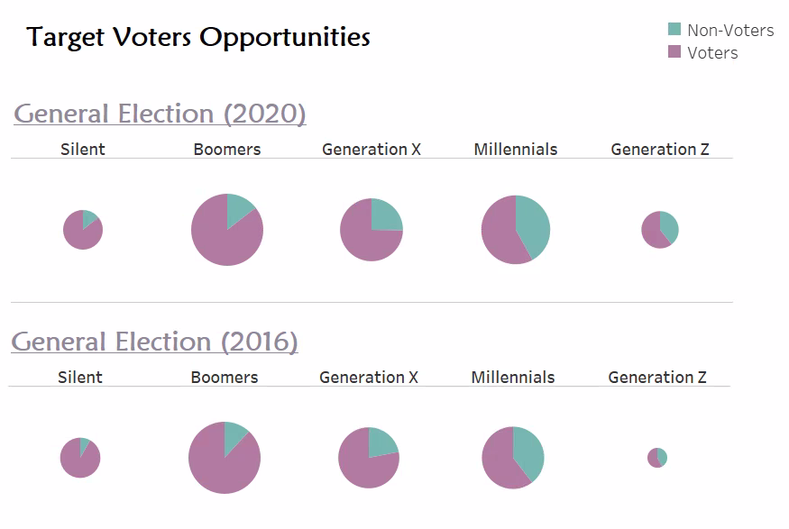

# GoVOTE

<p align="center">
  
</p>


## Table of Contents
1. [Presentation](#Presentation)
2. [Description of the Data Exploration Phase](#Description-of-the-Data-Exploration-Phase)
3. [Description of the Analysis Phase](#Description-of-the-Analysis-Phase)
4. [Team Questions](#Team-Questions)
5. [Role Distribution](#Role-Distribution)
6. [Technologies](#technologies-languages-tools-and-algorithms-used-throughout-the-project)
7. [Results of the Analysis](#Results-of-the-Analysis)
8. [Machine Learning Model](#Machine-Learning-Model)
9. [Database Integration](#Database-Integration)
10. [Schema](#Schema)
11. [Entity Relationship Diagram (ERD)](#Entity-Relationship-Diagram)
12. [Generation Breakdown](#Generation-Breakdown)
13. [Visual Representation](#Visual-Representation)
14. [Conclusion](#Conclusion)

### Presentation

#### Topic
  Analyzing voter registration and election results in Cuyahoga County by Age and Zip Code in order to determine trends in voting patterns


#### Reason we selected the topic
  The United States is experiencing high levels of political turmoil, making this topic extremely relevant. Our group identified potential factors contributing to voting trends within our shared home county, and analyzed voter data to relate geographical and generational identification to voting patterns. In analyzing this data we aim to predict which party affiliation groups are more likely to vote for based on these features, and which age groups are more likely to vote in a given area. Ultimately, we hope to illustrate which generational groups should receive additional attention to increase voter turnout.


#### Description of the source of data
  The Cuyahoga County Board of Elections serves its citizens by conducting the fundamental and vital functions of the election process. The Cuyahoga County Board of Elections has many datasets available to the public on their website [here](https://boe.cuyahogacounty.gov/maps-and-data). We chose to use a government site as opposed to a less credible source in order to ensure we are using clean and accurate data that adds purpose to our work. 


### Description of the Data Exploration Phase
 - We reviewed our dataset in excel and contacted the Board of Elections to explain the meaning of columns and their data
 - We determined which data was most relevant to our questions and which data wouldn't add value
 - After processing data in PGadmin, we noticed we wanted additional columns within the same table. We added another join to capture additional election data and organize everything, and eventually returned to PgAdmin to conduct more joins and data cleaning before exporting a final file.


### Description of the Analysis Phase
 - Divided data into specific dataframes
 - Joined data from primary elections, general elections, and voter demographic info
 - Organized data in bins based on generational groups/birth year
 - Performed counts and averages on total number of voters for party affiliation and generational group


### Team Questions

What story do you want your data to tell? 
 - We want our data to tell a story about voting trends within Cuyahoga County and how age and location affect these trends. We also want to highlight different generational groups in order to show differences between not only age, but entire generations.

Do you have a goal? 
 - Our goal is to ultimately showcase areas that need to increase voter turnout by pinpointing which generational groups vote less often. By developing interactive maps to showcase voting potential for a given user, we hope to paint a picture of current voting trends within a user's geographic location and help the user personally relate to the project and their own community's voting patterns. Our main goal is to get users to "GoVOTE."

What kind of message will your dashboard display? 
 - We intend to show historical voting data for presidential elections over the last 14 years and how it compares for each generational group and geographical area. We also want to highlight differences in primary election and general election where voters may have voted under a different party for on Combining this analysis with location mapping will hopefully enable users to shed light on their community and it's voting practices. 

Think of the top 5 things you want users to take away from your dashboard about your data.
- The user's voting trends vs others in their community
- The user's voting trends vs others in their generational group
- Potential prediction of the user's voting party affiliation in the next presidential election
- A sense of the voting trends all over Cuyahoga County and party affiliation in the last 4 primary elections
- A sense of the voting trends all over Cuyahoga County for the last 4 presidential elections

#### Questions We Hope to Answer with the Data

 - What generational group is more likely to vote? 
 - What geographical area has a higher percentage of voters?
 - What geographical areas has the highest number of boomers, gen z, etc?
 - Which age groups/zip codes are more likely to vote in the 2020 election?
 - How many members of NOPARTY voted vs did not vote?

 - Median Birth year of registered voters by zip code for Cuyahoga County, Ohio
 - Voting percentage by zip code for registered voters as of October 5th, 2020
 - Counts of party within each Generational Group

### Role Distribution

Circle - Database (Sarah)  
Square - Github (Leiana)  
Triangle - ML Model (Emad)  
X - Technologies used (Katterli)  


### Technologies, Languages, Tools, and Algorithms Used throughout the Project

Data Cleaning and Analysis

Pandas was utilized to clean data while completing an exploratory analysis on different aspects of the voter dataset. We used OnehotEncoding to determine party loyalty/changes to prepare for ML. We continued to clean our data once in Tableau as mapping illustrated new inconsistencies and outliers that were not previously apparent.

 - Reviewed data to determine non-viability of specific column information 
 - Determined required data to maximize utilization of dataset
 - Reviewed birth_date information to place in categorical sections
 - Determined overall effect on outcome when removing entire population based on birth year
 - Determined appropriate DataFrames to export to PgAdmin (csv)


Description of data preprocessing
 - Dropped unneeded columns (i.e voter demographic info, special election info, voting source)
 - Set index to voter_id_org
 - Removed voter personal information (names and addresses)
 - Cleaned columns with voter type prefixes to make ML easier
 - Reformatted zip codes to 5 digits for consistency (some were 9 digits)
 - Changed boolean values and string values to "0" and "1"
 - Cleaned up city names for consistency (Hts ->> Heights)
 - Dropped voter information with birth years prior to first generational bucket (1927 and earlier)
 - Organized birth year into buckets to show generational groups
 - Removed younger voter data for those unable to vote in earlier elections
 - One Hot coding (party affiliation)
 - Renamed Columns and Removed irrelevant information
 - Hyper parameter tuning to find optimal classifier
 - Grid Search CV
 - Code snippet examples below

```
# Removed unnecessary words in columnsvoter_df['CONG'] = voter_df['CONG'].str.replace('CONG', '')
voter_df['HSE'] = voter_df['HSE'].str.replace('HSE', '')
voter_df['SEN'] = voter_df['SEN'].str.replace('SEN', '')
voter_df['JUD'] = voter_df['JUD'].str.replace('MCD', '')
voter_df['CCD'] = voter_df['CCD'].str.replace('CCD', '')
voter_df.head()
```
```
group = {"Silent": 1,"Boomers": 2, "Generation X": 3, "Millenials": 4, "Generation Z": 5}
ml_df["Generational_Groups"] = ml_df["Generational_Groups"].apply(lambda x:group[x])
ml_df.head()
```
```
party={"D": 0, "R": 1, "L": 2, "0": 3, "N": 3, " ": 3, "G": 4, "X": 3}
ml_df['Primary_Election_2016'] = ml_df['Primary_Election_2016'].apply(lambda x:party[x])
ml_df['Primary_Election_2012'] = ml_df['Primary_Election_2012'].apply(lambda x:party[x])
ml_df['Primary_Election_2008'] = ml_df['Primary_Election_2008'].apply(lambda x:party[x])
ml_df['Primary_Election_2020'] = ml_df['Primary_Election_2020'].apply(lambda x:party[x])
```

Database Storage
 - We used PgAdmin (SQL) as our database, while integrating the data into Tableau for visual effects.

SQL Code Used to Join Tables and Rename Columns

 

### Results of the Analysis

Age and geographical area are significant indicators of voting practice in Cuyahoga County. Examining generational groups added an interesting and relevant way to look at voting trends. 

There are vast differences in number of registered voters versus number of active voters, adding insight we had not previously predicted. 

### Limitations of Analysis

 - Registration dates complicate analysis and ability to accurately represent data
 - Using a simplified dataset with limited demographic features may have exaggerated the importance of the features tested
 - Possible skewed data due to "dummy" dates used in Cuyahoga County dataset for registration dates
 - Not having party affiliation for general elections, only primary elections
 - Only using results from 2 election years because of generational groups not eligible to vote
 - Elections used were unique compared to previous elections due to political climate

### Recommendation for Future Analysis

Joining additional datasets from Cuyahoga County with our original datasets in order to use more features and increase predictability in machine learning model.

Obtain party data for general elections in order to predict outcomes and compare party affiliation changes.

Look at NOPRTY affiliation more closely and potentially determine which issues are important to these voters and how campaigns can be directed at this population.

### Anything the Team Would Have Done Differently

Allow more time to clean and analyze. We found relevant information regarding the dataset throughout the process, and found that we could have saved time going back to continue cleaning and creating new tables/data frames based on nuances and inconsistencies found later.


### Machine Learning Model

What is our model predicting? 

We are predicting registered voters' likeliness to vote in the 2020 General Election, based on historical voting practices, age, location, and party features in the dataset.


Description of data preprocessing

Dataset was scrutinized for relevant information and complete voter info prior to first run through ML model, and again after as new information was observed in Pandas, PgAdmin, and Tableau. Steps above (see Technologies section) were taken to ensure data was clean and appropriate to answer our questions.


Description of feature engineering and preliminary feature selection, including the decision-making process
 - Used birth year and zip code as features in first round of ML to help achieve answers to our questions on how age and location affected voting. 
 - Used generational buckets, city and party affiliation as supplemental features to better fit ML model
 - Previous voting history was also used as an indicator of potential to vote.


Description of how data was split into training and testing sets
 - SciKitLearn is the ML library we used to create a classification model
 - Split data into training and testing sets (80/20)
 - Assigned 2020 general election to x (as the target) and features to y were; zip code, city, age, generational bucket and voting history in the primaries for 2016 and 2020 and the general election in 2016.
 - Used One hot coding to establish generational buckets (Silent, Boomers, Generation X, Millennials, Generation Z)

 
Explanation of model choice, including limitations and benefits
 - We felt using Logistic Regression made sense given our dataset and in order to optimize our web app. Using Logistic Regression could potentially limit us, but we wanted to showcase the data using a baseline model first. A benefit to this model is simplicity and its lack of sensitivity to outliers while a limitation is the inability to fit datasets with sparse features. 

 ```
X20_train, X20_test, y20_train, y20_test = train_test_split(X20, y20, random_state=1)
classifier = LogisticRegression()
classifier
classifier.fit(X20_train, y20_train)
```
 - We used Random Forest Classifier and Gradient Boost Classifier as alternative/additional models to achieve a higher rate of accuracy after trying Logistic Regression
 - Random Forest Classifier which averages the predictions of multiple decision trees, generally works well on large datasets and is not sensitive to outliers. It is slow to train and not good at  fitting datasets with sparse features.
 - Gradient Boosting is an ensemble model that iteratively learns from weaker models to build a strong model. It allows for flexibility and works well with categorical data.  It is computationally time consuming and has a potential to overfit. 
 - Accuracy score analysis indicated that Gradient Boost Classifier had the best fit  for the training data and the best match on the test data. 
 
```
rf_model = RandomForestClassifier(n_estimators=128, random_state=78)
# Fitting the model
rf_model = rf_model.fit(X_train_scaled, y_train)
# Evaluate the model
y_pred = rf_model.predict(X_test_scaled)
print(f" Random forest predictive accuracy: {accuracy_score(y_test,y_pred):.3f}")
```

Explanation of changes in model choice
 - After an initial accuracy rate of 70% while running the Logistic Regression Classifer we added Gradient Boost Classifer and Random Forest Classifier models to increase accuracy. 


<p align="left">                                                                           
  
</p>


Description of how the model was trained (or retrained, if the team is using an existing model)

 - We identified that using all the voter data was not an accurate representation of the voters eligible to vote in a given election. For example, a voter born in 2002 is listed as a registered voter; however, they could not have voted in the 2008 election.  We had to further clean the data and only look at voters that were a.) old enough to vote in a given election and b.) had actually registered prior to the election date. 
 - Using the cleaned data and the Gradient Boost classifier, we used the Grid Search CV cross validation model to evaluate the performance of the model and to determine whether non-standard hyperparameters would result in a better fit. 
 - Modifiying the number of estimators, the learning rate and the max_depth, the revised model resulted in an accuracy score of 88%. 

Description and explanation of model's confusion matrix, including final accuracy score

 - The current accuracy score of the Gradient Boost Classifier model is 83%. Our results show that once the dataset was cleaned for the eligible voters, the models all performed within the same range or accuracy.  There was a slight improvement in the Gradient Boosting and Random forest with respect to precision and recall for identifying those voters who would not vote.  Since our stated goal was to find those voters who should be targeted by get out the vote efforts, the Gradient Boosting is the best predictive model for our purposes. 


<p align="center">
  
</p>

### Database Integration

Database stores static data for use during the project
 - PgAdmin/SQL  

Database interfaces with the project in some format
 - Exporting our tables to csv files after joining  

Includes at least two tables
 - We created 5 total tables and ultimately joined the data into one clean, abbreviated table  

Includes at least one join using the database language
 - All joins took place in PgAdmin utilizing SQL  

Includes at least one connection string
 - Exporting our tables to csv files after joining  




### Schema

Please reference [GoVote_schema](https://github.com/K8rly/GoVote/blob/main/GoVote_schema) showing work that has been completed in PGAdmin and Pandas


### Entity Relationship Diagram

<p align="center">
  
</p>


### Generation Breakdown


Birth Year    | Generational Group
------------- | -------------
1928-1945     | Silent
1946-1964     | Boomers
1965-1980     | Generation X  
1981-1996     | Millennials
1997-2012     | Generation Z


### Visual Representation

#### Tableau Dashboard Link


#### Google Slides Link [Here](https://docs.google.com/presentation/d/1MM8PHN10rRyozVNqGxoPIhzx3RIcxcASvziTmO43SMM/edit?usp=sharing)


#### Description of Tools Used in Dashboard

 - Tableau - utilized to display voting data results based on generational age brackets, reflecting voting patterns based on age and area of residence
 
 - Performed some cleaning in Tableau once we started mapping and noticed outliers and inconsistencies

 - Google Slides - utilized to tell our data story start to finish while providing additional graphics and questions that arose while mapping and tinkering


#### Description of Interactive Elements
 
 - Our Tableau dashboard will include hover-over functions within multiple maps and charts to display voting trends across the county


Median Birth Year of Voters by Zip Code for Cuyahoga County, Ohio

<p align="center">
  
</p>

*Color range is light to dark as birth year increases

Number of Voters in Last Four Presidential Elections by Generational Group

<p align="center">
  
</p>


#### Conclusion

### What can be done to increase voter turnout in Cuyahoga County?

Based on the population size and low rates of active voters, we propose that more attention be given to urban areas within Cuyahoga County in order to increase voter turnout.

Additionally, focusing on increasing voter turnout for primary elections could have significant effects on future general election outcomes.

Finally, we feel that Generation Z voters should be a targeted group as they have a very high registration rate, but significantly lower voter turnout rate.


