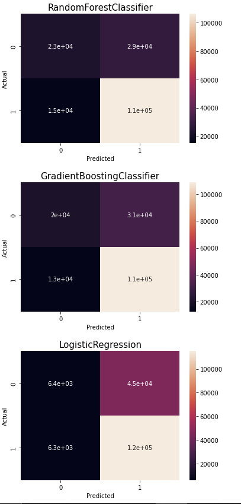
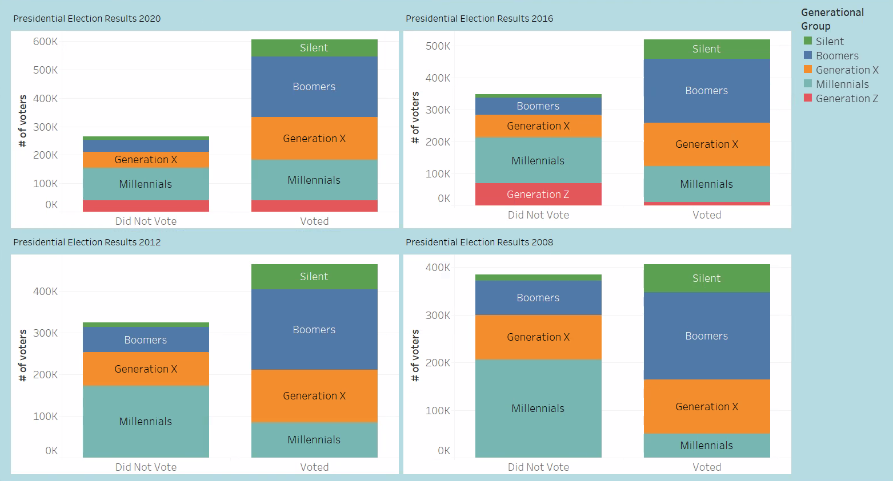

# GoVOTE

<p align="center">
  
</p>


## Table of Contents
1. [Presentation](#Presentation)
2. [Description of the Data Exploration Phase](#Description-of-the-Data-Exploration-Phase)
3. [Description of the Analysis Phase](#Description-of-the-Analysis-Phase)
4. [Team Questions](#Team-Questions)
5. [Technologies](#technologies-languages-tools-and-algorithms-used-throughout-the-project)
6. [Role Distribution](#Role-Distribution)
7. [Machine Learning Model](#Machine-Learning-Model)
8. [Database Integration](#Database-Integration)
9. [Schema](#Schema)
10. [ERD](#ERD)
11. [Generation Breakdown](#Generation-Breakdown)
12. [Dashboard](#Dashboard)


### Presentation

#### Topic
  Analyzing voter registration and election results in Cuyahoga County by Age and Zip Code in order to determine trends in voting patterns

<<<<<<< HEAD
#### Reason we selected the topic
  The United States is experiencing high levels of political turmoil, making this topic extremely relevant. Our group would like to identify potential factors contributing to voting trends within our shared home county, and analyze voter data to relate geographical and generational identification to voting patterns. In analyzing this data we hope to predict which party affiliation groups are more likely to vote for based on these features.

#### Description of the source of data
  The Cuyahoga County Board of Elections serves its citizens by conducting the fundamental and vital functions of the election process. The Cuyahoga County Board of Elections has many datasets available to the public on their website [here](https://boe.cuyahogacounty.gov/maps-and-data). We chose to use a government site as opposed to a less credible source in order to ensure we are using clean and accurate data. 
=======

#### Reason we selected the topic
  The United States is experiencing high levels of political turmoil, making this topic extremely relevant. Our group identified potential factors contributing to voting trends within our shared home county, and analyzed voter data to relate geographical and generational identification to voting patterns. In analyzing this data we aim to predict which party affiliation groups are more likely to vote for based on these features, and which age groups are more likely to vote in a given area. Ultimately, we hope to illustrate which generational groups should receive additional attention to increase voter turnout.


#### Description of the source of data
  The Cuyahoga County Board of Elections serves its citizens by conducting the fundamental and vital functions of the election process. The Cuyahoga County Board of Elections has many datasets available to the public on their website [here](https://boe.cuyahogacounty.gov/maps-and-data). We chose to use a government site as opposed to a less credible source in order to ensure we are using clean and accurate data that adds purpose to our work. 

>>>>>>> c71709bd42d5607b6c68096b2f6ccb026c2e20dc

### Description of the Data Exploration Phase
 - We reviewed our dataset in excel and contacted the Board of Elections to explain the meaning of columns and their data
 - We determined which data was most relevant to our questions and which data wouldn't add value
<<<<<<< HEAD
 - We updated null values in the dataset to "0" (did not vote)
 - After processing data in PGadmin, we noticed we wanted additional columns within the same table. We added another join to capture additional election data and organize everything.
=======
 - After processing data in PGadmin, we noticed we wanted additional columns within the same table. We added another join to capture additional election data and organize everything, and eventually returned to PgAdmin to conduct more joins and data cleaning before exporting a final file.

>>>>>>> c71709bd42d5607b6c68096b2f6ccb026c2e20dc

### Description of the Analysis Phase
 - Divided data into specific dataframes
 - Joined data from primary elections, general elections, and voter demographic info
 - Organized data in bins based on generational groups/birth year
<<<<<<< HEAD
 - Performed counts on total number of voters for: party affiliation, generational group
=======
 - Performed counts and averages on total number of voters for party affiliation and generational group
>>>>>>> c71709bd42d5607b6c68096b2f6ccb026c2e20dc


### Team Questions

What story do you want your data to tell? 
<<<<<<< HEAD
 - We want our data to tell a story about voting trends within Cuyahoga County and how age and city affect these trends. We also want to highlight different generational groups in order to show differences between not only age, but entire generations. 

Do you have a goal? 
 - Our goal is to ultimately develop a predictive tool to showcase voting potential for a given user. We also hope to paint a picture of current voting trends within a user's geographic location in order to help the user personally relate to the project and their own community's voting patterns.

What kind of message will your dashboard display? 
 - We want to show historical voting data for presidential elections over the last 14 years and how it compares to each generation group. Combining this analysis with location mapping will hopefully enable users to shed light on their community and it's voting practices. 
=======
 - We want our data to tell a story about voting trends within Cuyahoga County and how age and location affect these trends. We also want to highlight different generational groups in order to show differences between not only age, but entire generations.

Do you have a goal? 
 - Our goal is to ultimately showcase areas that need to increase voter turnout by pinpointing which generational groups vote less often. By developing interactive maps to showcase voting potential for a given user, we hope to paint a picture of current voting trends within a user's geographic location and help the user personally relate to the project and their own community's voting patterns. Our main goal is to get users to "GoVOTE."

What kind of message will your dashboard display? 
 - We intend to show historical voting data for presidential elections over the last 14 years and how it compares for each generational group and geographical area. We also want to highlight differences in primary election and general election where voters may have voted under a different party for on Combining this analysis with location mapping will hopefully enable users to shed light on their community and it's voting practices. 
>>>>>>> c71709bd42d5607b6c68096b2f6ccb026c2e20dc

Think of the top 5 things you want users to take away from your dashboard about your data.
- The user's voting trends vs others in their community
- The user's voting trends vs others in their generational group
<<<<<<< HEAD
- Prediction of the user's voting party affiliation in the next presidential election
- A sense of the voting trends all over Cuyahoga County and party affiliation in the last 4 primary elections
- A sense of the voting trends all over Cuyahoga County for the last 4 presidential elections

=======
- Potential prediction of the user's voting party affiliation in the next presidential election
- A sense of the voting trends all over Cuyahoga County and party affiliation in the last 4 primary elections
- A sense of the voting trends all over Cuyahoga County for the last 4 presidential elections


>>>>>>> c71709bd42d5607b6c68096b2f6ccb026c2e20dc
### Technologies, Languages, Tools, and Algorithms Used throughout the Project

Data Cleaning and Analysis

<<<<<<< HEAD
Pandas was utilized to clean data while completing an exploratory analysis on different aspects of the voter dataset. We used OnehotEncoding to determine party loyalty or changes to prepare for ML. We continued to clean our data once in Tableau as mapping illustrated new inconsistencies and outliers that were not previously apparent.

 - Review data to determine non-viability of specific column information 
 - Determine required data to maximize utilization of dataset
 - Review birth_date information to place in categorical sections
 - Determine overall effect on outcome when removing entire population based on birth year
 - Determine appropriate DataFrames to export to PgAdmin (csv)
=======
Pandas was utilized to clean data while completing an exploratory analysis on different aspects of the voter dataset. We used OnehotEncoding to determine party loyalty/changes to prepare for ML. We continued to clean our data once in Tableau as mapping illustrated new inconsistencies and outliers that were not previously apparent.

 - Reviewed data to determine non-viability of specific column information 
 - Determined required data to maximize utilization of dataset
 - Reviewed birth_date information to place in categorical sections
 - Determined overall effect on outcome when removing entire population based on birth year
 - Determined appropriate DataFrames to export to PgAdmin (csv)
>>>>>>> c71709bd42d5607b6c68096b2f6ccb026c2e20dc


Description of data preprocessing
 - Dropped unneeded columns (i.e voter demographic info, special election info, voting source)
 - Set index to voter_id_org
 - Removed voter personal information (names and addresses)
 - Cleaned columns with voter type prefixes to make ML easier
 - Reformatted zip codes to 5 digits for consistency (some were 9 digits)
<<<<<<< HEAD
 - Changed boolean values to "0" and "1"
=======
 - Changed boolean values and string values to "0" and "1"
>>>>>>> c71709bd42d5607b6c68096b2f6ccb026c2e20dc
 - Cleaned up city names for consistency (Hts ->> Heights)
 - Dropped voter information with birth years prior to first generational bucket (1927 and earlier)
 - Organized birth year into buckets to show generational groups
 - Removed Generation Z and Millennials data as younger generations were unable to vote in earlier elections
<<<<<<< HEAD
 - One Hot coding
 - Renamed Columns
 - Hyper parameter tuning to find optimal classifier
 - Grid Search CV
 - Voting classifier (soft)
=======
 - One Hot coding (party affiliation)
 - Renamed Columns and Removed irrelevant information
 - Hyper parameter tuning to find optimal classifier
 - Grid Search CV
 - Code snippet examples below

```
# Removed unnecessary words in columnsvoter_df['CONG'] = voter_df['CONG'].str.replace('CONG', '')
voter_df['HSE'] = voter_df['HSE'].str.replace('HSE', '')
voter_df['SEN'] = voter_df['SEN'].str.replace('SEN', '')
voter_df['JUD'] = voter_df['JUD'].str.replace('MCD', '')
voter_df['CCD'] = voter_df['CCD'].str.replace('CCD', '')
voter_df.head()
```
```
group = {"Silent": 1,"Boomers": 2, "Generation X": 3, "Millenials": 4, "Generation Z": 5}
ml_df["Generational_Groups"] = ml_df["Generational_Groups"].apply(lambda x:group[x])
ml_df.head()
```
```
party={"D": 0, "R": 1, "L": 2, "0": 3, "N": 3, " ": 3, "G": 4, "X": 3}
ml_df['Primary_Election_2016'] = ml_df['Primary_Election_2016'].apply(lambda x:party[x])
ml_df['Primary_Election_2012'] = ml_df['Primary_Election_2012'].apply(lambda x:party[x])
ml_df['Primary_Election_2008'] = ml_df['Primary_Election_2008'].apply(lambda x:party[x])
ml_df['Primary_Election_2020'] = ml_df['Primary_Election_2020'].apply(lambda x:party[x])
```
>>>>>>> c71709bd42d5607b6c68096b2f6ccb026c2e20dc

Database Storage
 - We used PgAdmin (SQL) as our database, while integrating the data into Tableau for visual effects.

<<<<<<< HEAD
 - We used SQL to split our data into additional tables and then join relevant information to form a final, clean datset. We removed voter demographics 
 voting record primary election (OneHotCoding - party affiliation D/F/N) - issues only ballot if non-partisan(N) voting record - general election with voter ID (Y = 1, Null = 0)

Machine Learning  
SciKitLearn is the ML library we used to create a classification model. Our training and testing set up is 80/20.

Dashboard
We will be using Tableau to display our findings, as well as Google slides for our overall presentation. Our ultimate goal is to create an interactive web app where users
=======
SQL Code Used to Join Tables and Rename Columns

 

>>>>>>> c71709bd42d5607b6c68096b2f6ccb026c2e20dc


#### Questions We Hope to Answer with the Data

 - What age group is more likely to vote? More likely to vote Republican or Democrat?
 - What zip code is more likely to vote? More likely to vote Republican or Democrat?
 - What geographical area has a higher percentage of voters/highest number of boomers, gen z, etc
 - **Prediction: Which age groups/zip codes are more likely to vote Republican or Democrat?
 - How many members of NOPARTY voted vs did not vote?
<<<<<<< HEAD
=======
 - How many voters changed their party affiliation from primary election to general election?
>>>>>>> c71709bd42d5607b6c68096b2f6ccb026c2e20dc


### Role Distribution

Circle - Database (Sarah)  
Square - Github (Leiana)  
Triangle - ML Model (Katterli)  
X - Technologies used (Emad)  


### Machine Learning Model

What is our model predicting? 

<<<<<<< HEAD
We are predicting registered voters' likeliness to vote in the 2020 General Election, based on features in the dataset.
=======
We are predicting registered voters' likeliness to vote in the 2020 General Election, based on age, location, and party features in the dataset.

>>>>>>> c71709bd42d5607b6c68096b2f6ccb026c2e20dc

Description of data preprocessing

Dataset was scrutinized for relevant information and complete voter info prior to first run through ML model, and again after as new information was observed in Pandas, PgAdmin, and Tableau. Steps above (see Technologies section) were taken to ensure data was clean and appropriate to answer our questions.

<<<<<<< HEAD
=======

>>>>>>> c71709bd42d5607b6c68096b2f6ccb026c2e20dc
Description of feature engineering and preliminary feature selection, including the decision-making process
 - Used birth year and zip code as features in first round of ML to help achieve answers to our questions on how age and location affected voting. *Our group decided to use zip code as opposed to city after viewing a map of the data in Tableau
 - Used generational buckets and party affiliation as supplemental features to better fit ML model
 - Previous voting history was also used as an indicator of potential to vote.

<<<<<<< HEAD
Description of how data was split into training and testing sets
=======

Description of how data was split into training and testing sets
 - SciKitLearn is the ML library we used to create a classification model
>>>>>>> c71709bd42d5607b6c68096b2f6ccb026c2e20dc
 - Split data into training and testing sets (80/20)
 - * Assigned general election to x (as the target) and features to y for each of the four presidential elections (2008, 2012, 2016, 2020)
 - Used One hot coding to establish generational buckets (Silent, Boomers, Generation X, Millennials, Generation Z)

<<<<<<< HEAD
```
=======
 
Explanation of model choice, including limitations and benefits
 - We felt using Logistic Regression made sense given our dataset and in order to optimize our web app. Using Logistic Regression could potentially limit us, but we wanted to showcase the data using a baseline model first. A benefit to this model is simplicity while a limitation would also be simplicity- such a simple model likely won't yield a robust accuracy score 

 ```
>>>>>>> c71709bd42d5607b6c68096b2f6ccb026c2e20dc
X20_train, X20_test, y20_train, y20_test = train_test_split(X20, y20, random_state=1)
classifier = LogisticRegression()
classifier
classifier.fit(X20_train, y20_train)
```
<<<<<<< HEAD
 
Explanation of model choice, including limitations and benefits
 - We felt using Logistic Regression made sense given our dataset and in order to optimize our web app. Using Logistic Regression could potentially limit us, but we wanted to showcase the data using a baseline model first. A benefit to this model is simplicity as well as the model working well to showcase our data with a web app
=======
>>>>>>> c71709bd42d5607b6c68096b2f6ccb026c2e20dc
 - We used Random Forest Classifier and Gradient Boost Classifier as alternative/additional models to achieve a higher rate of accuracy after trying Logistic Regression
 - Accuracy score analysis indicated that Gradient Boost Classifier had the best fit  for the training data and the best match on the test data. 
 - Adopted Grid Search CV as a way to increase accuracy score and perform hyper parameter tuning

<<<<<<< HEAD
Explanation of changes in model choice
 - After an initial accuracy rate of 77% while running the Logistic Regression Classifer we added Gradient Boost Classifer and Random Forest Classifier models to increase accuracy. 

Description of how we have trained the model thus far, and any additional training that will take place
 - We identified that using all the voter data was not an accurate representation of the voters eligible to vote in a given election. For example, a voter born in 2002 is listed as a registered voter; however, they could not have voted in the 2008 election.  We had to further clean the data and only look at voters that were a.) old enough to vote in a given election and b.) had actually registered prior to the election date. 
 - Using the cleaned data and the Gradient Boost classifier, we used the Grid Search CV, cross validation model to evaluate the performance of the model and to determine whether non-standard hyperparameters would result in a better fit. 
 - Modifiying the number of estimators, the learning rate and the max_depth, the revised model resulted in an accuracy score of 88%. 

Description of current accuracy score
 - The current accuracy score of the Gradient Boost Classifier model is 88%.

=======
```
rf_model = RandomForestClassifier(n_estimators=128, random_state=78)
# Fitting the model
rf_model = rf_model.fit(X_train_scaled, y_train)
# Evaluate the model
y_pred = rf_model.predict(X_test_scaled)
print(f" Random forest predictive accuracy: {accuracy_score(y_test,y_pred):.3f}")
```

Explanation of changes in model choice
 - After an initial accuracy rate of 77% while running the Logistic Regression Classifer we added Gradient Boost Classifer and Random Forest Classifier models to increase accuracy. 


<p align="left">                                                                           
  
</p>


<p align="right">
  
</p>

Description of how we have trained the model thus far, and any additional training that will take place

 - We identified that using all the voter data was not an accurate representation of the voters eligible to vote in a given election. For example, a voter born in 2002 is listed as a registered voter; however, they could not have voted in the 2008 election.  We had to further clean the data and only look at voters that were a.) old enough to vote in a given election and b.) had actually registered prior to the election date. 
 - Using the cleaned data and the Gradient Boost classifier, we used the Grid Search CV cross validation model to evaluate the performance of the model and to determine whether non-standard hyperparameters would result in a better fit. 
 - Modifiying the number of estimators, the learning rate and the max_depth, the revised model resulted in an accuracy score of 88%. 

Description of current accuracy score

 - The current accuracy score of the Gradient Boost Classifier model is 88%.


>>>>>>> c71709bd42d5607b6c68096b2f6ccb026c2e20dc
### Database Integration

Database stores static data for use during the project
 - PgAdmin/SQL  

Database interfaces with the project in some format
 - Exporting our tables to csv files after joining  

Includes at least two tables
 - We created 5 total tables and ultimately joined the data into one clean, abbreviated table  

Includes at least one join using the database language
 - All joins took place in PgAdmin utilizing SQL  

Includes at least one connection string
 - Exporting our tables to csv files after joining  

<<<<<<< HEAD
=======


>>>>>>> c71709bd42d5607b6c68096b2f6ccb026c2e20dc

### Schema

Please reference [GoVote_schema](https://github.com/K8rly/GoVote/blob/main/GoVote_schema) showing work that has been completed in PGAdmin and Pandas


### Entity Relationship Diagram (ERD)

<p align="center">
  
</p>


### Generation Breakdown


Birth Year    | Generational Group
------------- | -------------
1928-1945     | Silent
1946-1964     | Boomers
1965-1980     | Generation X  
1981-1996     | Millennials
1997-2012     | Generation Z


### Dashboard

<<<<<<< HEAD
#### Google Slides Link [Here](https://docs.google.com/presentation/d/1MM8PHN10rRyozVNqGxoPIhzx3RIcxcASvziTmO43SMM/edit?usp=sharing)

Images from the initial analysis
Data (images or report) from the machine learning task


*Color range is light to dark as birth year increases





*Color assigned by generational group


#### Description of Tools Used in Dashboard

 - Tableau - utilized to display the voting data results based on the generational age brackets, reflecting voting patterns based on age and area of residence, will include visuals such as mapping and graphs. Performed some cleaning in Tableau once we tried mapping.

 - Google Slides - utilized to tell our data story start to finish while providing additional graphics
=======

#### Description of Tools Used in Dashboard

 - Tableau - utilized to display voting data results based on generational age brackets, reflecting voting patterns based on age and area of residence, will include interactive mapping and graphs
 
 - Performed some cleaning in Tableau once we started mapping and noticed outliers and inconsistencies

 - Google Slides - utilized to tell our data story start to finish while providing additional graphics and questions that arose while mapping and tinkering
>>>>>>> c71709bd42d5607b6c68096b2f6ccb026c2e20dc


#### Description of Interactive Elements

 - Application that will allow users to enter their birth year, zip code, city, or city boundary from a drop down to create a prediction of which party they will vote.
 
 - Our Tableau dashboard will include a hover-over within multiple maps to display voting trends

<<<<<<< HEAD
=======
 
#### Google Slides Link [Here](https://docs.google.com/presentation/d/1MM8PHN10rRyozVNqGxoPIhzx3RIcxcASvziTmO43SMM/edit?usp=sharing)


Median Birth Year of Voters by Zip Code for Cuyahoga County, Ohio

<p align="center">
  
</p>

*Color range is light to dark as birth year increases

Number of Voters in Last Four Presidential Elections by Generational Group
<p align="center">
  
</p>

*Color assigned by generational group


>>>>>>> c71709bd42d5607b6c68096b2f6ccb026c2e20dc


