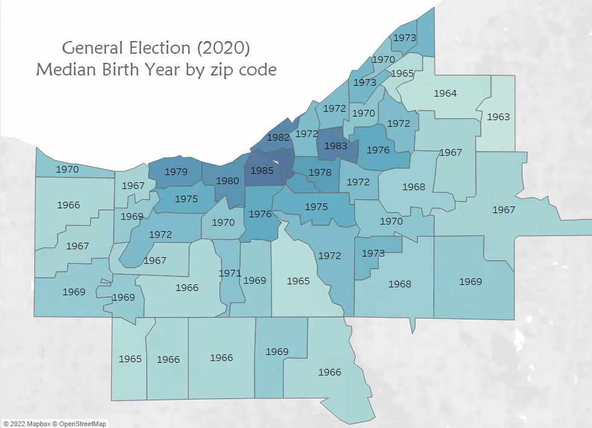

# GoVOTE

<p align="center">
  
</p>


## Table of Contents
1. [Presentation](#Presentation)
2. [Description of the Data Exploration Phase](#Description-of-the-Data-Exploration-Phase)
3. [Description of the Analysis Phase](#Description-of-the-Analysis-Phase)
4. [Team Questions](#Team-Questions)
5. [Technologies](#technologies-languages-tools-and-algorithms-used-throughout-the-project)
6. [Role Distribution](#Role-Distribution)
7. [Machine Learning Model](#Machine-Learning-Model)
8. [Database Integration](#Database-Integration)
9. [Schema](#Schema)
10. [ERD](#ERD)
11. [Generation Breakdown](#Generation-Breakdown)
12. [Dashboard](#Dashboard)


### Presentation

#### Topic
  Analyzing voter registration and election results in Cuyahoga County by Age and Zip Code in order to determine trends in voting patterns

#### Reason we selected the topic
  The United States is experiencing high levels of political turmoil, making this topic extremely relevant. Our group would like to identify potential factors contributing to voting trends within our shared home county, and analyze voter data to relate geographical and generational identification to voting patterns. In analyzing this data we hope to predict which party affiliation groups are more likely to vote for based on these features.

#### Description of the source of data
  The Cuyahoga County Board of Elections serves its citizens by conducting the fundamental and vital functions of the election process. The Cuyahoga County Board of Elections has many datasets available to the public on their website [here](https://boe.cuyahogacounty.gov/maps-and-data). We chose to use a government site as opposed to a less credible source in order to ensure we are using clean and accurate data. 

### Description of the Data Exploration Phase
 - We reviewed our dataset in excel and contacted the Board of Elections to explain the meaning of columns and their data
 - We determined which data was most relevant to our questions and which data wouldn't add value
 - We updated null values in the dataset to "0" (did not vote)
 - After processing data in PGadmin, we noticed we wanted additional columns within the same table. We added another join to capture additional election data and organize everything.

### Description of the Analysis Phase
 - Divided data into specific dataframes
 - Joined data from primary elections, general elections, and voter demographic info
 - Organized data in bins based on generational groups/birth year
 - Performed counts on total number of voters for: party affiliation, generational group


### Team Questions

What story do you want your data to tell? 
 - We want our data to tell a story about voting trends within Cuyahoga County and how age and city affect these trends. We also want to highlight different generational groups in order to show differences between not only age, but entire generations. 

Do you have a goal? 
 - Our goal is to ultimately develop a predictive tool to showcase voting potential for a given user. We also hope to paint a picture of current voting trends within a user's geographic location in order to help the user personally relate to the project and their own community's voting patterns.

What kind of message will your dashboard display? 
 - We want to show historical voting data for presidential elections over the last 14 years and how it compares to each generation group. Combining this analysis with location mapping will hopefully enable users to shed light on their community and it's voting practices. 

Think of the top 5 things you want users to take away from your dashboard about your data.
- The user's voting trends vs others in their community
- The user's voting trends vs others in their generational group
- Prediction of the user's voting party affiliation in the next presidential election
- A sense of the voting trends all over Cuyahoga County and party affiliation in the last 4 primary elections
- A sense of the voting trends all over Cuyahoga County for the last 4 presidential elections

### Technologies, Languages, Tools, and Algorithms Used throughout the Project

Data Cleaning and Analysis

Pandas was utilized to clean data while completing an exploratory analysis on different aspects of the voter dataset. We used OnehotEncoding to determine party loyalty or changes to prepare for ML. We continued to clean our data once in Tableau as mapping illustrated new inconsistencies and outliers that were not previously apparent.

Database Storage
 - We used PgAdmin (SQL) as our database, while integrating the data into Tableau for visual effects.

 - We used SQL to split our data into additional tables and then join relevant information to form a final, clean datset. We removed voter demographics 
 voting record primary election (OneHotCoding - party affiliation D/F/N) - issues only ballot if non-partisan(N) voting record - general election with voter ID (Y = 1, Null = 0)

Machine Learning

SciKitLearn is the ML library we used to create a classification model. Our training and testing set up is 80/20.

Dashboard

We will be using Tableau to display our findings, as well as Google slides for our overall presentation. Our ultimate goal is to create an interactive web app where users


#### Questions We Hope to Answer with the Data

 - What age group is more likely to vote? More likely to vote Republican or Democrat?
 - What zip code is more likely to vote? More likely to vote Republican or Democrat?
 - What geographical area has a higher percentage of voters/highest number of boomers, gen z, etc
 - **Prediction: Which age groups/zip codes are more likely to vote Republican or Democrat?
 - How many members of NOPARTY voted vs did not vote?


### Role Distribution

Circle - Database (Sarah)  
Square - Github (Leiana)  
Triangle - ML Model (Katterli)  
X - Technologies used (Emad)  


### Machine Learning Model

Description of data preprocessing
 - Removed unneeded columns (special elections are not county-wide and were not relevant)
 - Removed voter personal information (names and addresses)
 - Cleaned columns with prefixes to make ML easier
 - Reformatted zip codes to 5 digits for consistency (some were 9 digits)
 - Changed boolean values to "0" and "1"
 - Cleaned up city names for consistency (Hts ->> Heights)
 - Removed ages before 1st generational bin (1927 and earlier)
 - Organized birth year into buckets to show generational groups
 - Removed Generation Z and Millennials data as younger generations were unable to vote in earlier elections
 - One Hot coding
 - Renamed Columns
 - Hyper parameter tuning to find optimal classifier
 - Grid Search CV
 - Voting classifier (soft)

Description of feature engineering and preliminary feature selection, including the decision-making process
 - Used birth year and zip code as features in first round of ML to help achieve answers to our questions on how age and location affected voting. *Our group decided to use zip code as opposed to city after viewing a map of the data in Tableau
 - Used generational buckets and party affiliation as supplemental features to better fit ML model

Description of how data was split into training and testing sets
 - Split data into training and testing sets (80/20)
 - Assigned data to x and y for each of the four presidential elections (2008, 2012, 2016, 2020)
 - Used One hot coding to establish generational buckets (Silent, Boomers, Generation X, Millennials, Generation Z)

```
X20_train, X20_test, y20_train, y20_test = train_test_split(X20, y20, random_state=1)
classifier = LogisticRegression()
classifier
classifier.fit(X20_train, y20_train)
```
 
Explanation of model choice, including limitations and benefits
 - We felt using Logistic Regression made sense given our dataset and in order to optimize our web app. Using Logistic Regression could potentially limit us, but we wanted to showcase the data using a baseline model first. A benefit to this model is simplicity as well as the model working well to showcase our data with a web app
 - We used Random Forest Classifier and Gradient Boost Classifier as alternative/additional models to achieve a higher rate of accuracy after trying Logistic Regression
 - Played with features and added parameters to avoid overfitting
 - Adopted Grid Search CV as a way to increase accuracy score and perform hyper parameter tuning

Explanation of changes in model choice
 - After an initial accuracy rate of ----% while running the Logistic Regression Classifer we added Gradient Boost Classifer and Random Forest Classifier models to increase accuracy. 

Description of how we have trained the model thus far, and any additional training that will take place


Description of current accuracy score


### Database Integration

Database stores static data for use during the project
 - PgAdmin/SQL  

Database interfaces with the project in some format
 - Exporting our tables to csv files after joining  

Includes at least two tables
 - We created 5 total tables and ultimately joined the data into one clean, abbreviated table  

Includes at least one join using the database language
 - All joins took place in PgAdmin utilizing SQL  

Includes at least one connection string
 - Exporting our tables to csv files after joining  


### Schema

Please reference [GoVote_schema](https://github.com/K8rly/GoVote/blob/main/GoVote_schema) showing work that has been completed in PGAdmin and Pandas


### Entity Relationship Diagram (ERD)

<p align="center">
  
</p>


### Generation Breakdown


Birth Year    | Generational Group
------------- | -------------
1928-1945     | Silent
1946-1964     | Boomers
1965-1980     | Generation X  
1981-1996     | Millennials
1997-2012     | Generation Z


### Dashboard

#### Google Slides Link [Here](https://docs.google.com/presentation/d/1MM8PHN10rRyozVNqGxoPIhzx3RIcxcASvziTmO43SMM/edit?usp=sharing)

Images from the initial analysis



*Color range is light to dark as birth year increases

Data (images or report) from the machine learning task


#### Description of Tools Used in Dashboard

 - Tableau - utilized to display the voting data results based on the generational age brackets, reflecting voting patterns based on age and area of residence, will include visuals such as mapping and graphs. Performed some cleaning in Tableau once we tried mapping.

 - Google Slides - utilized to tell our data story start to finish while providing additional graphics


#### Description of Interactive Elements

 - Application that will allow users to enter their birth year, zip code, city, or city boundary from a drop down to create a prediction of which party they will vote.
 
 - Our Tableau dashboard will include a hover-over within multiple maps to display voting trends


